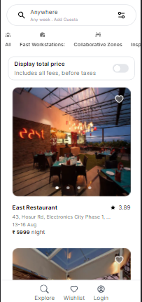
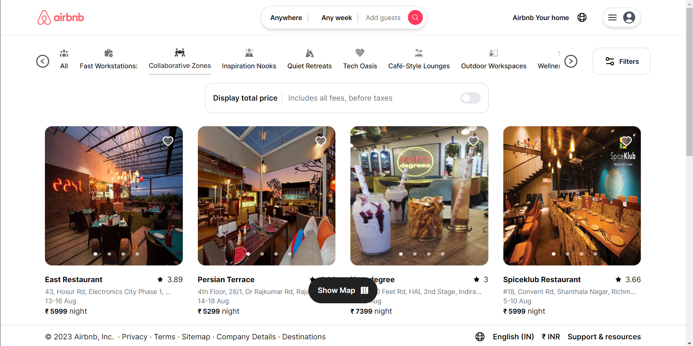

This is a [Next.js](https://nextjs.org/) project hosted on vercel at [https://airbnb-faspace.vercel.app](https://airbnb-faspace.vercel.app/)

## Tools used

[Next.js](https://nextjs.org/) , [Tailwind CSS](https://tailwindcss.com/) , [React](https://react.dev/) , [React Icons](https://react-icons.github.io/react-icons/) , [React-slick](https://react-slick.neostack.com/) and [Sanity.io](https://www.sanity.io/)

## How I went about making it 

First, I used Pesticide on the main Airbnb website. Pesticide - a tool that allows us to see the page layout.
It gave me a brief idea about the layout of the website.

Next I found the Logo from the Internet and looked for the icons on React-Icons. Having previously worked with React Icons, I knew I would find them here.

## Challenges

1. The first challenge was to replace the original category options with options that were relevant to Faspace. I brainstromed and used ChatGPT for the options and their descriptions. Wrote them as a json object and looped over them using map.

2. Then I had to find a way to fetch the data in such a way that I could request for 4 Restaurants on scrolling and store the data. Sanity.io was my instant pick. I could arrange pics, store them and get all that information fetched to the frontend just as I would using a real backend.

3. Building the ui. I used Tailwind CSS to style the UI. The whole process was effortless. I used react-slick for the carousel and react icons library for the icons.

4. Responsiveness. The whole page is fully responsive on mobile phones and larger screens and looks and feels just as the main website. Screenshots attatched on both phone and laptop respectively.

## Deploy on Vercel

The easiest way to deploy your Next.js app is to use the [Vercel Platform](https://vercel.com/new?utm_medium=default-template&filter=next.js&utm_source=create-next-app&utm_campaign=create-next-app-readme) from the creators of Next.js.

Check out our [Next.js deployment documentation](https://nextjs.org/docs/deployment) for more details.
